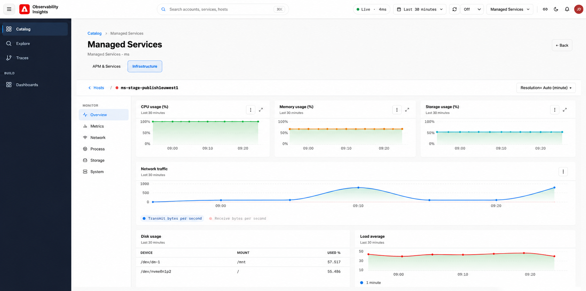

# 主機 {#hosts}

在Observability Insights中使用主機來監控支援應用程式和服務之基礎建設的健全狀態、效能和資源使用率。 使用基礎架構儀表板來識別與主機容量、儲存壓力、網路輸送量或作業系統資源爭用相關的問題。

## 基礎架構監控可協助您回答哪些問題 {#what-infrastructure-monitoring-helps-you-answer}

當您需要回答下列問題時，基礎架構監視最有用：

- 應用程式速度減慢會伴隨CPU、記憶體或I/O壓力嗎？
- 相同環境中一台主機的行為與其他主機是否不同？
- 網路或磁碟模式是否在與客戶事件相同的間隔內變更？
- 儲存使用率趨勢是否指向即將發生的容量問題？

## 存取基礎結構主機 {#infrastructure-host-overview}

基礎架構監控提供主機層級的可見度，讓您瞭解支援受管理AEM環境之基礎架構的健康狀況和效能。 從&#x200B;**可觀察性目錄**，您可以瀏覽基礎結構主機並鑽研個別主機，以調查CPU、記憶體、網路、儲存裝置和其他系統層級的訊號。

## 存取基礎結構主機

從&#x200B;**目錄**，選取&#x200B;**主機**&#x200B;索引標籤，以檢視與所選帳戶關聯的基礎結構。

**基礎結構主機**&#x200B;檢視提供受監視主機的詳細目錄，包括：

- **主機名稱** — 受監視基礎結構主機的名稱。
- **帳戶** — 與主機關聯的帳戶。
- **環境** — 環境分類，例如`DEV`或`STAGE`。
- **健全狀態** — 主機的目前健全狀態。
- **上次出現時間** — 最近從主機收到遙測的時間。

## 建議的調查流程 {#suggested-investigation-flow}

針對大多數事件，請依下列順序檢閱主機控制面板：

1. 檢查CPU使用率、平均負載和記憶體使用率，以找出明顯的飽和度。
2. 如果回應時間增加而沒有相符的CPU尖峰，請檢閱CPU I/O等待和磁碟輸送量。
3. 比較網路輸送量與應用程式流量，以識別與負載相關的轉換。
4. 檢查儲存使用量和檔案系統層級磁碟使用量，以瞭解持續性的容量風險。
5. 比較多部主機，檢視問題是否為本地化或系統性問題。

## 先檢閱內容 {#what-to-review-first}

- **CPU和記憶體** （當應用程式在較廣的時間範圍內顯示緩慢或不穩定時）。
- 當要求意外停止或佇列時，**磁碟I/O和CPU I/O等候**。
- 當流量特性變更或懷疑下游相依性時，**網路I/O**。
- **當事件涉及部署失敗、索引壓力或長期容量問題時，使用儲存空間**。

使用&#x200B;**Name contains**&#x200B;欄位和&#x200B;**Tier**&#x200B;篩選器來縮小主機清單。 選取主機名稱，以開啟其基礎架構監視詳細資訊。

## 主機監視

選取主機後，**基礎架構**&#x200B;檢視會提供該主機的專用監視頁面。

主機導覽包括：

- **總覽** — 關鍵基礎建設狀況與使用率訊號的整合檢視。
- **量度** — 詳細的主機效能量度，包括CPU、記憶體、負載、磁碟I/O和網路輸送量。
- **網路** — 網路流量、介面活動和傳輸/接收錯誤。
- **處理序** — 主機處理序層級監視。
- **儲存體** — 磁碟使用率、磁碟I/O和檔案系統使用率。
- **系統** — 核心系統資源量度，例如CPU、記憶體和平均負載。

## 調查期間要回答的問題 {#questions-to-answer}

- 問題是孤立於單一主機，還是在整個環境中皆可見？
- CPU、記憶體或磁碟訊號是否會在與事件相同的視窗中提升？
- 儲存增長的趨勢是否趨向於可能影響作業的臨界值？
- 基礎架構症狀是否可解釋應用程式行為，或僅表現為下游效應？

## 呈報時要擷取的證據 {#evidence-to-capture}

- 受影響的環境和主機
- 問題的時間視窗
- CPU、記憶體、磁碟和網路熒幕擷取畫面
- 異常是孤立的還是系統性的
- 來自APM的相關應用程式症狀
