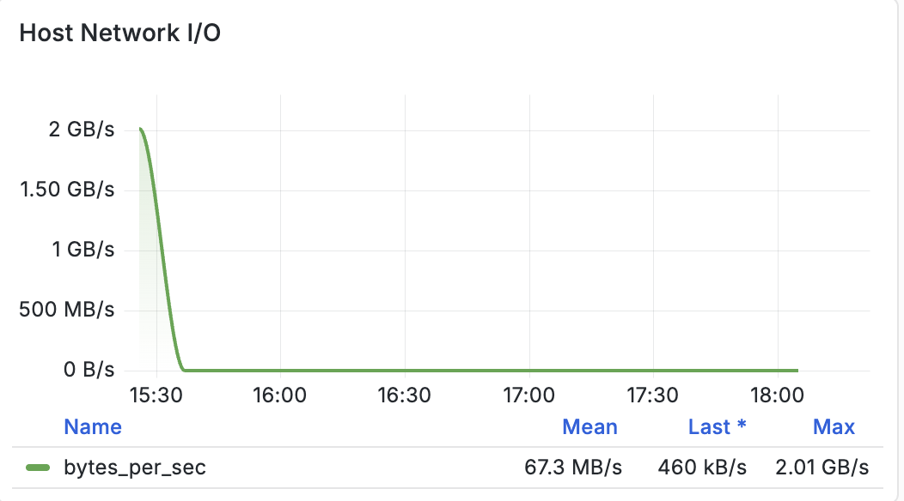
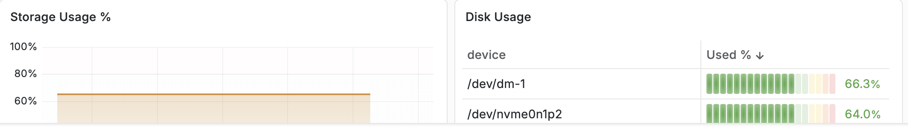
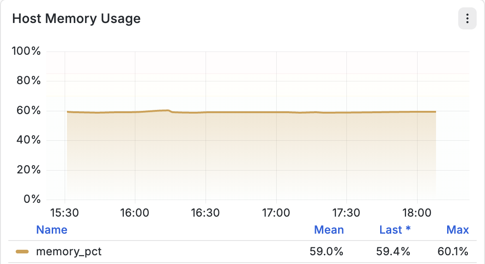

# 主機基礎結構監視儀表板

本節說明基礎架構監視控制面板上顯示的每個主機層級基礎架構監檢視形。 每個區段都會說明量度的用途、收集的資料、測量單位，以及視覺效果中呈現的資訊。

## 控制面板概觀

「主機基礎結構監視儀表板」可即時顯示基礎主機的使用率和效能。 這些量度可協助營運商監控運算、記憶體、儲存及網路資源，同時找出潛在的資源瓶頸。

控制面板包含下列監視面板：

- 主機CPU使用率
- 主機磁碟I/O
- 主機網路I/O
- CPU I/O等待
- 儲存空間使用量
- 磁碟使用情況
- 主機CPU平均載入
- 主機記憶體使用率

## &#x200B;1. 主機CPU使用率

### 說明

**[!UICONTROL 主機CPU使用率]**&#x200B;面板會顯示作業系統和所有執行中的處理序目前在一段時間內所使用的CPU資源百分比。

此量度代表主機上的整體CPU使用量，並提供處理器活動的時間序列視覺效果。

圖表可讓操作員在選取的觀察期間監視CPU使用量的變化。

### 量度

| 量度 | 說明 |
| --------- | ---------------------------------------- |
| `cpu_pct` | 目前使用中的CPU總數百分比 |

### 單位

- 百分比(%)

### 顯示的統計資料

面板會使用三個值摘要CPU使用率：

| 統計資料 | 說明 |
| --------- | --------------------------------------------------------------- |
| 平均值 | 所選時間範圍內的平均CPU使用率 |
| 過去 | 最近收集的CPU使用率值 |
| 最大值 | 在所選時間範圍內觀察到的最高CPU使用率 |

### 圖表元件

- 代表CPU使用率的時間序列線。
- 以百分比為基礎的Y軸範圍介於&#x200B;**0%到100%**&#x200B;之間。
- 圖表下方顯示的摘要統計資料。
- 所選監督間隔的歷史趨勢。

## &#x200B;2. 主機磁碟I/O

### 說明

**[!UICONTROL 主機磁碟I/O]**&#x200B;面板會顯示主機所執行之磁碟讀取和磁碟寫入作業的儲存輸送量。

此圖表呈現兩個獨立的時間序列，代表作業系統與儲存裝置之間傳輸的資料。

此視覺效果可協助監視一段時間內的儲存活動，並提供insight在磁碟中讀取和寫入的資料量。

### 量度

| 量度 | 說明 |
| ------------ | --------------------------------- |
| `disk_read` | 從儲存讀取的資料量 |
| `disk_write` | 寫入儲存裝置的資料量 |

在內部，這些量度會使用平滑的輸送量值來顯示。

### 單位

- 每秒位元組數(B/s)
- 千位元組/秒(KB/s)
- 每秒MB (MB/s)
- 每秒GB (GB/s)

顯示的單位會根據輸送量自動調整。

### 圖表元件

- 代表磁碟讀取輸送量的綠線。
- 代表磁碟寫入輸送量的橘色線。
- 時間序列視覺效果。
- 每個量度都有個別的圖例。
- 目前顯示在每個序列旁邊的量度值。

## &#x200B;3. 主機網路I/O

### 說明

**[!UICONTROL 主機網路I/O]**&#x200B;面板會顯示主機在一段時間內所傳輸和接收的網路流量。

圖表會測量資料流經網路介面的速率，並提供網路頻寬消耗的可見度。
此測量結果代表彙總網路輸送量。

### 量度

| 量度 | 說明 |
| --------------- | --------------------------------------------------------------------- |
| `bytes_per_sec` | 以每秒傳輸的位元組數來測量彙總網路輸送量 |

### 單位

圖表會自動調整規模，介於：

- 位元組/秒
- KB/秒
- MB/秒
- GB/秒

視觀察到的流量而定。

### 顯示的統計資料

| 統計資料 | 說明 |
| --------- | ---------------------------------- |
| 平均值 | 平均網路輸送量 |
| 過去 | 最近的輸送量測量 |
| 最大值 | 觀察到的最高輸送量 |

### 圖表元件

- 單一輸送量行。
- 時間序列視覺效果。
- 動態頻寬調整。
- 圖表下方顯示的摘要統計資料。

## &#x200B;4. CPU I/O等待

### 說明

**[!UICONTROL CPU I/O等待]**&#x200B;面板會顯示CPU等候輸入/輸出作業完成所花費的時間百分比。

此測量結果代表發生於等待儲存裝置或其他I/O作業時，因為作用中處理序遭到封鎖而發生的處理器閒置時間。

圖表會以視覺效果呈現I/O等待在一段時間內的變化。

### 量度

| 量度 | 說明 |
| --------- | ------------------------------------------------------ |
| `cpu_pct` | CPU等待I/O作業所花費的時間百分比 |

### 單位

- 百分比(%)

### 顯示的統計資料

| 統計資料 | 說明 |
| --------- | ------------------------------- |
| 平均值 | 平均CPU I/O等待百分比 |
| 過去 | 最近記錄的值 |
| 最大值 | 最高記錄值 |

### 圖表元件

- 時間序列線。
- 百分比型Y軸。
- 摘要統計資料。
- 歷史趨勢視覺效果。

## &#x200B;5. 儲存空間使用量

### 說明

**[!UICONTROL 儲存空間使用量]**&#x200B;面板會顯示目前受監視主機上使用的儲存空間容量整體百分比。

圖表提供所選時間間隔內檔案系統容量使用率的歷史檢視。

### 量度

| 量度 | 說明 |
| --------------- | -------------------------------------------------- |
| 儲存空間使用率% | 目前已使用的已分配儲存空間百分比 |

### 單位

- 百分比(%)

### 圖表元件

- 時間序列使用率圖表。
- 百分比刻度。
- 歷史儲存使用情況趨勢。

## &#x200B;6. 磁碟使用情況

### 說明

**[!UICONTROL 磁碟使用量]**&#x200B;面板會顯示每個已掛接檔案系統或儲存裝置的儲存使用量。

每一列對應到特定的區塊裝置或掛載的分割區，並報告目前使用的空間百分比。

此表格提供儲存體使用率的檔案系統層級劃分。

### 顯示的資訊

每個專案包含：

| 欄位 | 說明 |
| --------------- | -------------------------------------------- |
| 裝置 | 掛載的儲存裝置或檔案系統 |
| 已使用% | 已使用的儲存容量百分比 |
| 使用率列 | 以視覺化方式呈現儲存空間消耗 |

### 單位

- 百分比(%)

### 圖表元件

- 檔案系統/裝置清單。
- 使用率百分比。
- 以色彩編碼的容量指標。
- 已排序的使用率值。

## &#x200B;7. 主機CPU平均載入

### 說明

**[!UICONTROL 主機CPU平均負載]**&#x200B;面板會顯示三個滾動時間範圍內的Linux系統平均負載。

與CPU使用率不同，平均負載代表主動執行或等候CPU排程或I/O完成的流程平均數。

圖表同時顯示三個滾動平均值，可提供短期和長期工作負載趨勢。

### 量度

| 量度 | 說明 |
| ---------- | -------------------------------------------- |
| `load_1m` | 過去1分鐘的平均系統負載 |
| `load_5m` | 過去5分鐘的平均系統負載 |
| `load_15m` | 過去15分鐘的平均系統負載 |

### 單位

- 平均載入（無維度值）

### 顯示的統計資料

針對每個負載平均量度：

| 統計資料 | 說明 |
| --------- | --------------------------------------- |
| 平均值 | 所選時間範圍內的平均負載 |
| 過去 | 最新記錄的載入值 |
| 最大值 | 觀察到的負載值最高 |

### 圖表元件

- 三條獨立的趨勢線。
- 時間序列視覺效果。
- 每個滾動平均值的個別圖例。
- 每個測量結果的摘要統計資料。

## &#x200B;8. 主機記憶體使用率

### 說明

**[!UICONTROL 主機記憶體使用量]**&#x200B;面板會顯示作業系統目前配置的實體系統記憶體百分比。

此測量結果代表所有執行中的處理作業、核心記憶體、緩衝區和快取的總體RAM使用率。

此圖表提供所選監督期間記憶體耗用的連續檢視。

### 量度

| 量度 | 說明 |
| ------------ | ---------------------------------------------- |
| `memory_pct` | 目前使用中的實體記憶體百分比 |

### 單位

- 百分比(%)

### 顯示的統計資料

| 統計資料 | 說明 |
| --------- | ---------------------------------- |
| 平均值 | 平均記憶體使用率 |
| 過去 | 最近記錄的使用率 |
| 最大值 | 觀察到的最高使用率 |

### 圖表元件

- 時間序列記憶體使用率圖表。
- 百分比型Y軸。
- 歷史使用率趨勢。
- 摘要統計資料。

## 控制面板量度摘要

| 控制面板面板 | 主要量度 | 單位 |
| --------------------- | -------------------------------- | ------------ |
| 主機CPU使用率 | `cpu_pct` | % |
| 主機磁碟I/O | `disk_read`, `disk_write` | 位元組/秒 |
| 主機網路I/O | `bytes_per_sec` | 位元組/秒 |
| CPU I/O等待 | `cpu_pct` | % |
| 儲存空間使用量 | 儲存空間使用率% | % |
| 磁碟使用情況 | 檔案系統使用 | % |
| 主機CPU平均載入 | `load_1m`, `load_5m`, `load_15m` | 平均載入 |
| 主機記憶體使用率 | `memory_pct` | % |
