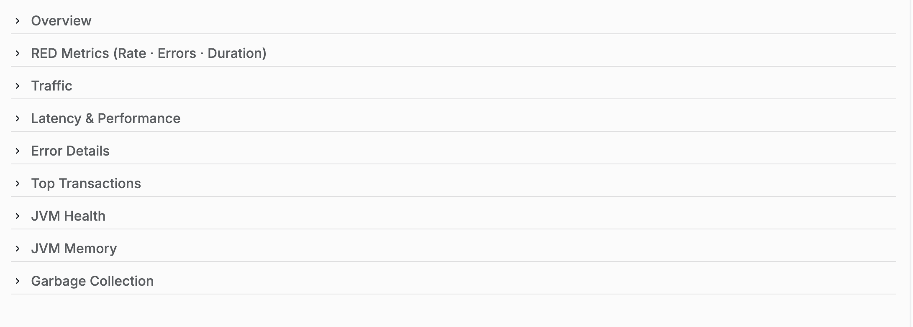

# APM儀表板參考 {#apm-dashboard-reference}

本參考記錄了AEM Managed Services中使用的主要可觀察性深入分析APM面板。

## 控制面板導覽



控制面板會組織為可展開的區段，將相關的應用程式效能度量分組。 展開區段會顯示與該類別相關聯的一或多個圖表。

## 概觀


### 說明

**總覽**&#x200B;區段提供高階關鍵績效指標(KPI)，用於摘要目前受監視應用程式的狀態。

這些KPI提供應用程式活動、輸送量、請求成功和整體使用者體驗的簡單摘要。

### 量度

#### 要求總數

顯示應用程式在選取的時間範圍內處理的要求總數。

**量度**

```
total_requests
```

**單位**

- 計數

#### 目前輸送量

顯示目前的請求處理速率。

**量度**

```
throughput
```

**單位**

- 每秒要求數

#### 目前的錯誤率

顯示造成錯誤的請求百分比。

**量度**

```
error_rate
```

**單位**

- 百分比(%)

#### APDEX分數

顯示應用程式績效指數(APDEX)，這是根據應用程式回應時間，對使用者滿意度的標準化測量。

設定的臨界值會顯示在Widget中。

**量度**

```
apdex_score
```

**單位**

- 分數(0.0 - 1.0)

## 紅色量度

RED方法可測量應用程式的三個主要特性：

- **費率**
- **個錯誤**
- **持續時間**

### 請求率


#### 說明

顯示一段時間內收到的應用程式要求數目。

此圖表使用時間序列視覺效果來表示請求輸送量。

#### 量度

```
req_min
```

#### 單位

- 每分鐘要求數（要求/分鐘）

#### 顯示的資訊

- 時間序列請求率
- 歷史請求活動
- 請求率趨勢
- 量度圖例

### 錯誤率


#### 說明

顯示導致錯誤的要求百分比。

圖表會比較歷史和目前的錯誤百分比。

#### 量度

```
error_pct (now)
error_pct (1h ago)
```

#### 單位

- 百分比(%)

#### 顯示的資訊

- 目前的錯誤百分比
- 歷史比較
- 平均值
- 時間序列趨勢

### 請求持續時間


#### 說明

顯示多個回應時間百分位數的請求延遲。

圖表同時以圖形表示在選取的觀察期間收集到的百分位數延遲測量。

#### 量度

```
P50
P75
P90
```

#### 單位

- 毫秒(ms)
- 秒

單位會根據回應持續時間自動調整。

#### 顯示的統計資料

對於每個百分位數：

- 平均值
- 過去
- 最大

#### 百分位數定義

| 量度 | 說明 |
| ------ | ----------------------------- |
| P50 | 第50個百分位回應時間 |
| P75 | 第75個百分位回應時間 |
| P90 | 第90個百分位回應時間 |

## 流量

### 依HTTP狀態代碼提出的請求


#### 說明

顯示依HTTP回應狀態代碼分組的要求輸送量。

每個狀態代碼會隨著時間而獨立繪圖。

#### 量度

常見量度包括：

```
req_s 200
req_s 300
req_s 400
req_s 500
```

視應用程式活動而定。

#### 單位

- 每秒要求數

#### 顯示的資訊

- 依HTTP狀態區分的輸送量
- 平均輸送量
- 最新輸送量
- 最大輸送量
- 時間序列活動

### 依端點的要求速率


#### 說明

顯示依請求率排名的最高流量應用程式端點。

每個端點會顯示為代表要求音量的水準長條。

#### 量度

```
endpoint_request_rate
```

#### 單位

- 每分鐘要求數（要求/分鐘）

#### 顯示的資訊

- 端點路徑
- 請求率
- 排名端點清單
- 相對請求量

## 延遲和效能

### 回應時間 — P95與1小時


#### 說明

顯示目前的P95回應時間與前一小時記錄的P95回應時間的比較。

兩個資料集都會顯示在相同的時間序列圖表上。

#### 量度

```
P95 (Current)
P95 (1 Hour Ago)
```

#### 單位

- 毫秒(ms)
- 秒

#### 顯示的統計資料

- 平均值
- 過去
- 最大

### 一段時間的APDEX分數


#### 說明

將「應用程式績效指數」顯示為連續的時間序列。

此圖表會在整個選取的監督間隔中顯示APDEX值。

#### 量度

```
APDEX Score
```

#### 單位

- 分數(0.0-1.0)

#### 顯示的統計資料

- 平均值
- 過去
- 最大

### 傳輸量與P95延遲的比較


#### 說明

在相同的時間表上顯示要求輸送量和P95回應延遲。

圖表可讓您同時以視覺效果呈現流量和回應延遲。

#### 量度

```
Throughput
P95 Latency
```

#### 單位

| 量度 | 單位 |
| ----------- | ------------ |
| 輸送量 | 要求數/秒 |
| P95延遲 | 毫秒 |

#### 顯示的資訊

- 時間序列輸送量
- 時間序列延遲
- 雙量度比較

## 錯誤詳細資料

### 錯誤率% （依狀態群組）

按狀態群組

#### 說明

顯示依HTTP回應類別分組的應用程式錯誤百分比。

系統會為每個回應類別繪製個別系列。

#### 量度

常見群組包括：

```
2xx
3xx
4xx
5xx
Combined Error Trend
```

視觀察到的流量而定。

#### 單位

- 百分比(%)

#### 顯示的資訊

- 依據回應類別的錯誤百分比
- 平均錯誤百分比
- 時間序列趨勢

### 錯誤率趨勢 — 現在與1小時前


#### 說明

顯示目前的應用程式錯誤率，以及前一小時記錄的錯誤率。

#### 量度

```
Current Error Ratio
1 Hour Error Ratio
```

#### 單位

- 百分比(%)

#### 顯示的資訊

- 目前趨勢
- 歷史比較
- 時間序列視覺效果

### 錯誤率趨勢 — 現在與6小時前


#### 說明

顯示目前的應用程式錯誤率，以及六小時前記錄的錯誤率。

#### 量度

```
Current Error Ratio
6 Hour Error Ratio
```

#### 單位

- 百分比(%)

#### 顯示的資訊

- 目前的錯誤率
- 歷史比較
- 時間序列視覺效果

## 控制面板量度摘要

| 儀表板 | 主要量度 |
| -------------------------- | --------------------------------------------- |
| 概觀 | 要求總數、輸送量、錯誤率、APDEX |
| 請求率 | 每分鐘要求數 |
| 錯誤率 | 錯誤百分比 |
| 請求持續時間 | P50、P75、P90延遲 |
| 按狀態代碼請求 | HTTP狀態輸送量 |
| 依端點的要求速率 | 端點要求磁碟區 |
| 回應時間比較 | 目前與歷史P95 |
| APDEX分數 | 使用者滿意度指數 |
| 輸送量與延遲 | 要求輸送量和P95延遲 |
| 依狀態群組的錯誤率 | HTTP狀態群組錯誤百分比 |
| 錯誤率趨勢 | 目前與歷史錯誤比率 |
